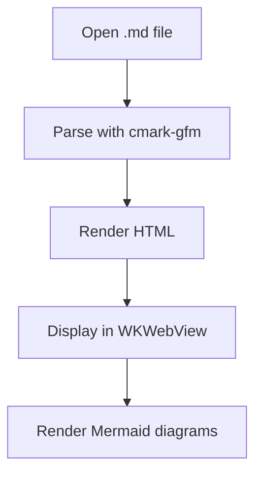

# MDViewer Test Document

This is a sample document to test **bold**, *italic*, and `inline code`.

## GFM Table

| Feature | Status |
|---------|--------|
| Markdown parsing | Done |
| Mermaid diagrams | Done |
| LaTeX typography | Done |

## Code Block

```swift
func greet(name: String) -> String {
    return "Hello, \(name)!"
}
```

## Mermaid Diagram



## Block Quote

> The purpose of abstraction is not to be vague,
> but to create a new semantic level in which one can be absolutely precise.
> — Edsger W. Dijkstra

## Task List

- [x] Set up project
- [x] Implement renderer
- [ ] Ship it

---

*End of test document.*
